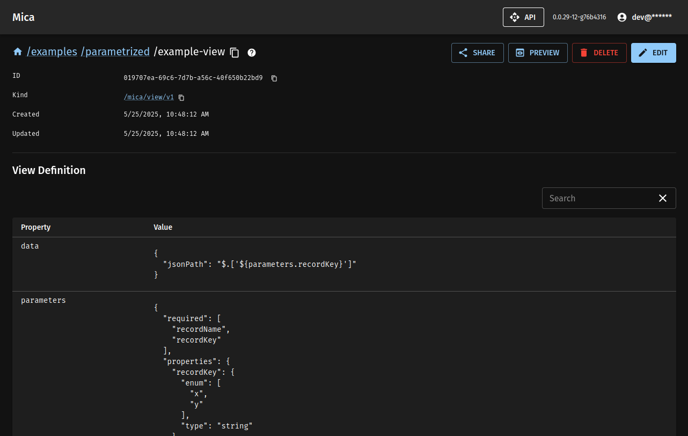
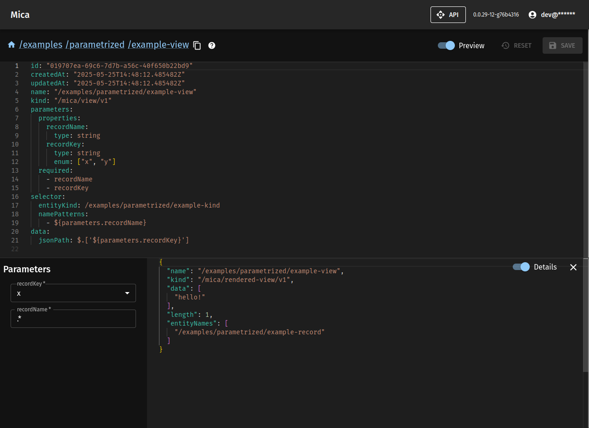

# mica

A configuration management system.

Features:
- Multiple data source support:
  - internal database;
  - Git repositories;
  - S3 buckets;
  - Concord [Json Stores](https://concord.walmartlabs.com/docs/getting-started/json-store.html)
- User-defined "views" to merge, filter and modify YAML and JSON documents pulled different data sources;
- Simple "dashboards" to visualize data;
- API access;
- OIDC support.




## Prerequisites

- JDK 17

## Building

```
./mvnw clean install -DskipTests
```

The resulting JAR `mica-concord-server-plugin/target/mica-concord-server-plugin-*.jar`
can be added directly to the classpath of a concord-server.

## Running in IDE

Start `ca.ibodrov.mica.its.LocalMicaServer` with the following environment variables:

- `TEST_OIDC_AUTHSERVER` - the OIDC server URL, for example https://dev-12345678.okta.com;
- `TEST_OIDC_CLIENTID` - the OIDC client ID;
- `TEST_OIDC_SECRET` - the OIDC client secret.

You should be able to access the UI by visiting http://localhost:8080/mica

## Running in Production

Mica is built to run as a part of [concord-server](https://github.com/walmartlabs/concord) 2.7.0+
The easiest way to run it is to use [mica-sidecar](./docker) Docker image.

## UI Development

```
cd mica-ui
npm run dev
```

See package.json for other actions.

## Integration Tests

Integration tests are skipped during regular builds. Use `-DskipITs=false` to
enable integration tests during the build:

```
./mvnw clean install -DskipITs=false
```

## Development Notes

- [mvnd](https://github.com/apache/maven-mvnd) works well with this project:
  ```
  > mvnd formatter:format
  [INFO] Total time:  0.086 s (Wall Clock)
  ```

- re-build the database module to let `mica-concord-server-plugin` use the updated schema:
  ``` 
  ./mvnw -pl :mica-db clean install
  ```
