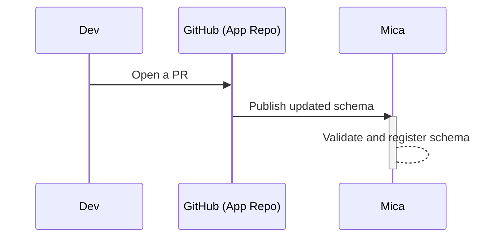
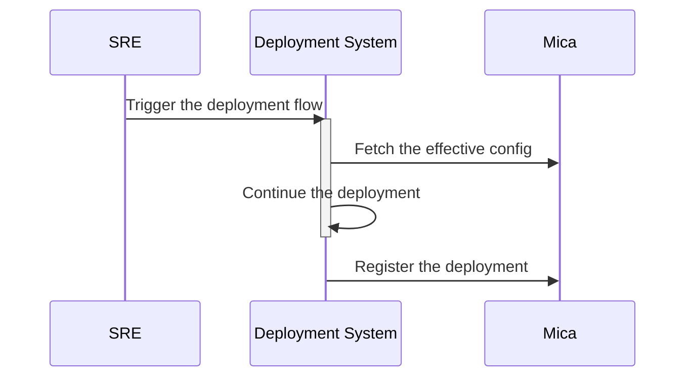

# Mica

## Open Questions

- push vs pull
  - should the push model be the end goal? 
- profile repository structure
- inheritance and/or composition syntax/rules

## TODO

mica-server:
- model:
  - introduce `spec`
- e2e test:
  - publish schema
  - publish profile
  - fetch effective config

## Terminology

- `component` -- a logical unit of deployment, defines property types;
- `deployment` -- instance of a `component`;
- `property` -- a key-value pair;
- `profile` -- a named collection of properties with values;
- `effective profile` -- a set of properties calculated from selected profiles
  using provided conditionals (e.g. for a specific client + a target deployment
  site + a target cluster) and a merge function.
- `merge function` -- receives a set of profiles, generates the effective set
  of properties.

## Migration From Vanilla ck8s

### Initial Migration

During the initial migration, "legacy" configuration parameters are turned into
Mica schema and profile files.

Assumptions:
- there's a ck8s component `ck8s-ext/ck8s-components/foo`;
- the current configuration is in `clusterRequest.foo.*`, e.g.
  ```yaml
  clusterRequest:
    foo:
      bar: "example clusterRequest.foo.bar value"
      baz: "example clusterRequest.foo.baz value"
  ```
- the current component's configuration is also split between multiple files:
  ```
  ck8s/flows/ck8s-configs/ck8s.yaml
  ck8s-ext/ck8s-orgs/acme/organization.yaml
  ck8s-ext/ck8s-orgs/acme/accounts/dev/cluster.yaml
  ```

Steps:
- create the component schema file:
  ```yaml
  # ck8s-ext/ck8s-components/foo/schema.mica.yaml
  kind: MicaComponent/v1
  name: ck8s-foo
  spec:
    properties:
      bar:
        type: string
      baz:
        type: string
  ```
- create the profiles, TBD
  
### Final Migration

Assumptions:
- The initial migration has been completed for
  the `ck8s-ext/ck8s-components/foo` component;
- The component's vendor will be responsible for maintaining the schema file.

Steps:
- Move the component's schema file into the upstream repository.
- Add the necessary CI steps to publish the updated schema.

## Scenarios

### Application Release

Assumptions:
- application developers provide a schema file that is up-to-date with the app
  changes. Ideally, there should be no way to make configuration code changes
  without updating the schema.



### Deployment

Assumptions:
- the application is released;
- the artifacts are ready;
- Mica got the up-to-date information;
- there is a deployment system that can use Mica. For example, ck8s.



## Implementation Ideas

### Concord as Data Source

Mica can use Concord's JSON store as a data source.

### ck8s-cli Integration

To build an effective confguration for a given `clusterAlias` ck8s-cli
[deep-merges](https://github.com/concord-workflow/ck8s-cli/blob/382a93a613be4e2b0ee64c28a5f9f507c304e71f/common/src/main/java/dev/ybrig/ck8s/cli/common/Ck8sUtils.java#L101)
the values in the following files:

```
ck8s/flows/ck8s-configs/ck8s.yaml
ck8s-ext/ck8s-orgs/${orgName}/organization.yaml
ck8s-ext/ck8s-orgs/${orgName}/accounts/${accountName}/account.yaml
```
and one of
```
ck8s/**/cluster.yaml
ck8s-org/**/cluster.yaml
```
whichever contains the given `clusterAlias`.

Configuration received from Mica must be applied last.

There are two ways we can integrate ck8s-cli with Mica:
- grab all necessary configuration parameters from Mica before starting
  the process (let's call it the push model)
- or pull parameters on the per-component basis, directly in the component's
  flow (the pull model).

The push model requires the knowledge which components are going to be
deployed and how to form a `clusterRequest` object.

The pull model requires a good UX story for local development -- e.g. being
able to run flows without a Mica instance.

Pull scenario:
- someone starts Mica's own deployment process:
  ```
  $ ck8s-cli -c mica-test -f mica
  ```
- as the first step in the flow, Mica task is executed to fetch the config:
  ```yaml
  - task: ck8s-mica
    in:
      action: getEffectiveProfile
      selector:
        clusterAlias: ${clusterRequest.clusterAlias}
        componentName: mica
        version: ${orDefault('clusterRequest.mica.version', 'current')}
  ```
- the task merges the received Mica config into `clusterRequest.mica`;
- the process continues as usual.

### Profile Tree

How to link Components and Profiles?

Options:
- require a profile ref in components?
- support inheritance in profiles?
- define a DAG of "instances of components", each node is a pair of
  `component ref` + `profile ref`?
- go the other way: profile is a set of `component refs` + property values.
  Continuing: a deployment is an instance of a profile.
